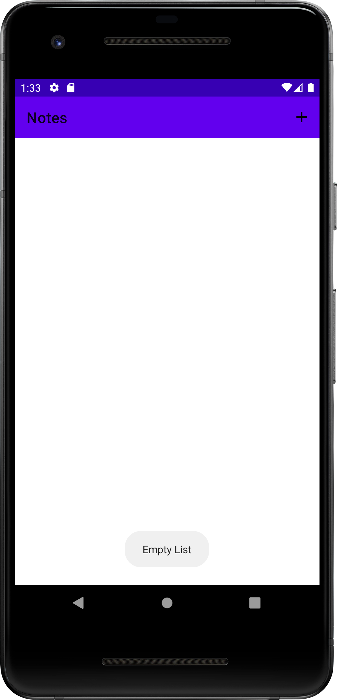
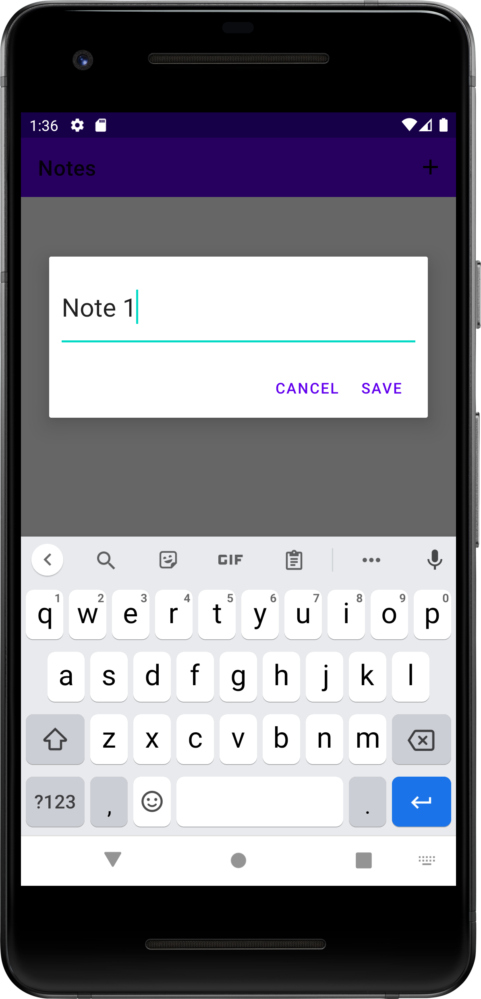
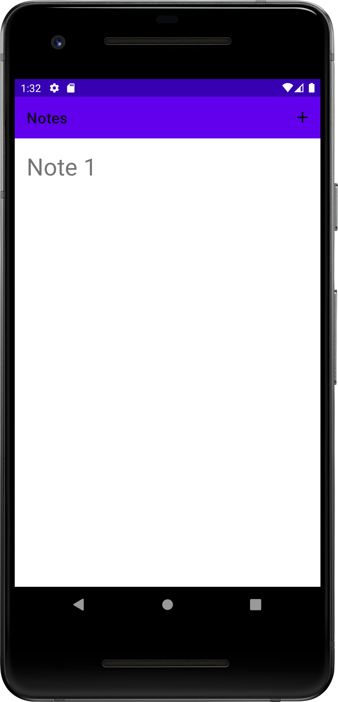
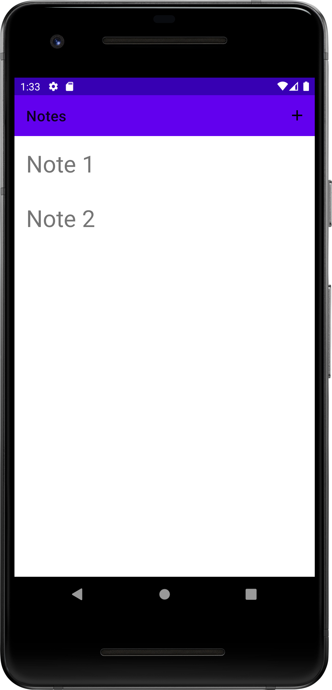

<h1 align="center">
    <br />
<br />
</h1>

<p align="center">

  

  <a href="https://www.linkedin.com/in/veloso-lucas/">
    
  </a>

  

  

</p>

<p align="center">
  <a href="#-About-The-Project">About The Project</a>&nbsp;&nbsp;|&nbsp;&nbsp;&nbsp;
  <a href="#Technologies">Technologies</a>&nbsp;&nbsp;&nbsp;|&nbsp;&nbsp;&nbsp;
  <a href="#construction-%EF%B8%8F-layouts-construction">Layouts</a>&nbsp;&nbsp;&nbsp;|&nbsp;&nbsp;&nbsp;
  <a href="#information_source-how-to-use">How to use</a>&nbsp;&nbsp;&nbsp;
</p>


## 💻 About The Project

In the development of mobile applications there are several aspects to be studied and learned, personally whenever I start the study of a new technology I like to use a course with a small project to have an overview of this technology.

That's why this project was done using the course [Android Development MVVM Architecture][course-link]

And the certificate generated at the end of the course can be accessed at this [link][certificate]

## 📱 Layouts
<h1 align="center">
    
    <span>&nbsp&nbsp&nbsp&nbsp&nbsp&nbsp&nbsp&nbsp&nbsp&nbsp&nbsp&nbsp&nbsp&nbsp&nbsp&nbsp</span>
    
</h1>

<h1 align="center">
    
    <span>&nbsp&nbsp&nbsp&nbsp&nbsp&nbsp&nbsp&nbsp&nbsp&nbsp&nbsp&nbsp&nbsp&nbsp&nbsp&nbsp</span>
    
</h1>


## Technologies

This project was developed to study the following points:

- [Koin][koin]
- [MVVM][mvvm]
- [Kotlin][kotlin]


## How To Use 

To run this project make sure you have install :[Git](https://git-scm.com), [Android Studio](https://developer.android.com/studio)

### To run the APP

```bash
# Use the command below to clone this repository
$ git clone https://github.com/Velosofurioso/Mobile-Development-Courses.git

# Open the android studio

# Import the project to run in android studio 

# Open an emulator, with sdk 28 or above

# From play pro android studio build the project, generate the apk and run in the emulator 
```

*OBS. 
If you run the mobile project, if possible, I recommend that you run it using virtualization on your pc, because if it runs directly on your cell phone, you will need to change the address being used for the API to make the requests in the project to your computer's ip address.


Proudly developed by [Lucas Veloso](https://www.linkedin.com/in/veloso-lucas/)

[koin]: https://insert-koin.io/
[mvvm]: https://developer.android.com/topic/libraries/architecture/viewmodel?hl=pt-br
[kotlin]: https://kotlinlang.org/docs/home.html
[course-link]: https://www.udemy.com/course/arquitectura-mvvm-no-android/
[certificate]: https://www.udemy.com/certificate/UC-e1e02099-0104-408d-a95c-81879d0bd03a/